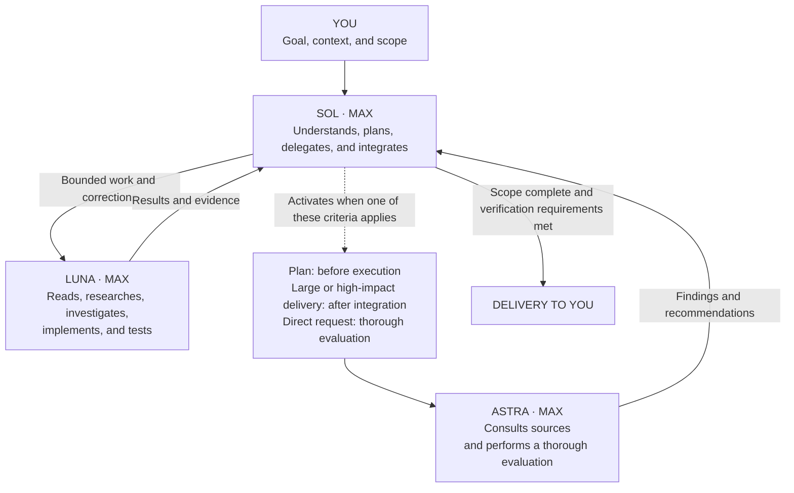

# Codex Project Orchestrator

**Sol `max` coordinates, Luna `max` executes, and Astra `max` evaluates at defined points.**

Sol owns requirements, plans, and integration. Luna handles bounded reading, investigation, implementation, and verification. Astra evaluates implementation plans, large or high-impact deliveries, and direct requests for a thorough evaluation.

[Português](README.md) · [Architecture and sources](docs/architecture.md) · [Detailed installation guide](docs/installation.md)

## Quick start

Requirements: Python 3.11+, a Codex client supporting custom agents, and account access to the configured models. The target project must be trusted in Codex. Model access is not provided by this repository.

Clone this repository or download its ZIP. From the repository root:

```sh
python3 -m venv .venv
source .venv/bin/activate
python -m pip install -r requirements.txt

python install.py install --project "/path/to/your-project" --dry-run
python install.py install --project "/path/to/your-project"
python install.py status --project "/path/to/your-project"
```

On Windows PowerShell:

```powershell
py -3 -m venv .venv
.\.venv\Scripts\python.exe -m pip install -r requirements.txt
.\.venv\Scripts\python.exe install.py install --project "C:\projects\your-project" --dry-run
.\.venv\Scripts\python.exe install.py install --project "C:\projects\your-project"
```

`--project` is required and must point to your target project, not the installer repository. A dry run does not create files or directories. Installer messages are currently in Portuguese.

Open a new Codex task after installation. Verify the selected model and effort. If preserving usage is your priority, keep Fast off; the Codex CLI provides `/fast off` and `/fast status`.

## What is installed

Everything goes into the target project:

- `.codex/config.toml`: selected settings merged while preserving unrelated options and comments.
- `.codex/agents/cpo_*.toml`: three Luna execution roles and one Astra evaluation role.
- `AGENTS.md`: an appended policy block. A nonempty root `AGENTS.override.md` takes precedence when present.
- `.codex/.gitignore`: ignores installer state and backups.
- `.codex/.project-orchestrator/`: local metadata and copies of preexisting files for restoration.

No personal Codex configuration is modified. Project configuration still inherits settings that are not overridden and respects environment policies. The installer does not change authentication, sandbox permissions, MCP configuration or project trust.

## Roles and modes

| Role | Model | Reasoning effort |
|---|---|---|
| Orchestration primary | `gpt-5.6-sol` | **`max`** |
| `cpo_explorer` | `gpt-5.6-luna` | **`max`** |
| `cpo_worker` | `gpt-5.6-luna` | **`max`** |
| `cpo_investigator` | `gpt-5.6-luna` | **`max`** |
| `cpo_reviewer` | `gpt-6-astra` | **`max`** |



Typically use zero or one helper, with a maximum of two concurrent helpers including reviewers. Concurrency is not a token or spending cap. Every executor validates its own work; there is no mandatory testing agent.

Astra evaluates a consolidated implementation plan before execution, a consolidated implementation whose complexity or impact warrants deep evaluation, or an object explicitly submitted for thorough evaluation. “Super avalie” is an example request, not a literal command: equivalent requests, negations, and quoted text are interpreted by the agent. File or line counts do not determine significance, and a small task does not need a formal plan just to activate a reviewer.

Sol checks requirements and integration without duplicating Astra's deep evaluation. Astra examines relevant sources independently. Corrections go back to Luna; any necessary reassessment focuses on previous findings and the effects of fixes. Plan evaluation and implementation evaluation cover different objects. Continue already-authorized implementation after addressing plan findings; stop at the plan or evaluation when that is all the user requested. Explicit restrictions and solo modes take precedence, and an unavailable evaluation must be reported as not performed.

Three explicit installation modes are available:

| `--mode` | Primary | Helpers |
|---|---|---|
| `orchestration` — default | Sol **`max`** | Enabled, maximum 2 |
| `everyday` | Terra `medium` | Disabled |
| `economy` | Luna **`max`** | Disabled |

```sh
python install.py install --project "/path/to/your-project" --mode economy
```

Reinstalling an unchanged installation is idempotent. Version 0.2.0 can upgrade intact 0.1.0 installations while preserving original backups and agent filenames. Preview the update with `--dry-run`. Modes are selected explicitly; there is no natural-language classifier or automatic primary-model switching. A model selector alone does not switch the remaining mode settings.

## Restore and maintain

```sh
python install.py uninstall --project "/path/to/your-project" --dry-run
python install.py uninstall --project "/path/to/your-project"
```

Uninstall restores the state before the first installation, provided managed files and backups are intact. If you edit a managed file afterward, install and uninstall stop without overwriting it. There is no force option. Preserve your changes and use the [manual recovery procedure](docs/installation.md#arquivos-modificados-e-recuperação).

Generated agents, settings and instructions may be committed to the target project's Git repository. Other contributors can use them directly in Codex without running this installer. Backups are intentionally local and ignored by Git, so automatic restoration is unavailable in a different clone that lacks this state. Manual installations are also not tracked by the installer.

`status` reports the installed version, the primary model read from disk, and file consistency, including installations awaiting an upgrade. It does not inspect the active Codex runtime. Exit codes are `0` for success, `1` for no recorded installation during status, and `2` for errors or drift.

## Tests and limitations

```sh
python -m unittest discover -s tests -v
```

Tests use temporary projects and do not call LLMs or the network. CI is configured for Linux, macOS and Windows with Python 3.11 and 3.14. Check the published workflow results before treating every platform as verified.

The repository includes semantic evaluation cases for future manual runs; no model-quality benchmark or subscription-usage savings are claimed. Maximum effort for Sol, Luna, and Astra in orchestration is a deliberate policy, not proof that it is optimal for every task. Usage depends on evaluation frequency, context, and rework. Normal write failures trigger rollback, but power loss and forced process termination require manual recovery.

This is an independent project, not an official OpenAI product or endorsement. Architectural inspiration includes [donvito/codex-astra-luna-orchestrator](https://github.com/donvito/codex-astra-luna-orchestrator/). This implementation's installer and instructions were written for this repository.

Official references: [Subagents](https://learn.chatgpt.com/docs/agent-configuration/subagents), [Configuration](https://learn.chatgpt.com/docs/config-file/config-basic), [AGENTS.md](https://learn.chatgpt.com/docs/agent-configuration/agents-md), [Luna](https://developers.openai.com/api/docs/models/gpt-5.6-luna).

License: [MIT](LICENSE). Contributions: [CONTRIBUTING.md](CONTRIBUTING.md).
