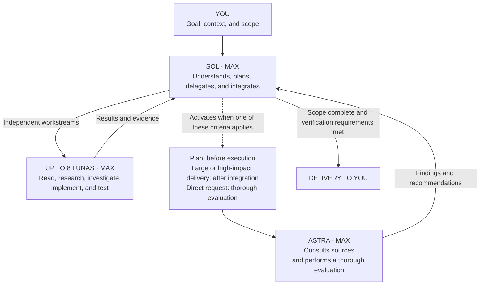

# Codex Project Orchestrator

**Sol `max` coordinates, Luna `max` executes, and Astra `max` evaluates at defined points.**

Sol owns requirements, plans, and integration. Luna handles bounded reading, investigation, implementation, and verification. Astra evaluates implementation plans, large or high-impact deliveries, and direct requests for a thorough evaluation.

[Português](README.md) · [Architecture and sources](docs/architecture.md) · [Detailed installation guide](docs/installation.md)

## Install or update with an AI agent

Send this repository URL to the agent already working in the target project. You do not need to clone the repository or run Python yourself; the agent handles those steps. This request is sufficient:

> Install or update Codex Project Orchestrator in the current project by following its README: https://github.com/luisjuniorj/codex-project-orchestrator

If you are the agent performing the operation, follow this protocol:

1. Resolve the target project root. Use the project the user is working on; the installer checkout is never the target. If more than one path is plausible, clarify the path before writing.
2. Obtain a fresh checkout of this repository in a temporary directory outside the target. Read the README from that checkout and do not copy templates by hand.
3. Create the virtual environment inside the checkout and install `requirements.txt`. Do not alter the global Python or Codex installation.
4. Run `install --dry-run` with the absolute target path. The same command handles a fresh installation and a recorded update.
5. If the preview succeeds, run `install` without `--dry-run`, then run `status`. On drift, collisions, or invalid backups, do not force, delete state, or overwrite files; report the paths and cause to the user.
6. Inspect only the installer-reported files in the target Git worktree. Report the installed version, changed paths, and `status` result. Do not commit or push unless the user requested it.
7. Tell the user to open a new Codex task so the configuration is loaded.

This flow is deliberately idempotent. An agent does not need to detect the installed version or uninstall before an update: use a current installer checkout and repeat `install --dry-run`, `install`, and `status`.

### Why the agent runs the installer

Direct file copying handles only the four `cpo_*.toml` agents. A complete installation must also:

- Merge controlled options into `.codex/config.toml` without deleting MCPs, sandbox settings, providers, comments, or other project preferences.
- Select the active instruction file between `AGENTS.md` and `AGENTS.override.md`, then append or update only the delimited policy block.
- Detect collisions and later edits before replacing content.
- Preserve prior state and backups used by updates, verification, and restoration.
- Validate generated files and roll back completed writes after a normal operation failure.

Asking every agent to reproduce this logic from natural-language instructions adds variation and context usage. The temporary checkout obtains the current version; the local installer applies it repeatably. [Manual installation](docs/installation.md#instalação-manual) remains available when Python cannot be used, without automatic state and restoration support.

## Command-line installation

Requirements: Python 3.11+, a Codex client supporting custom agents, and account access to the configured models. The target project must be trusted in Codex. Model access is not provided by this repository.

Clone this repository or download its ZIP into a directory outside the target project. From the installer checkout:

```sh
python3 -m venv .venv
source .venv/bin/activate
python -m pip install -r requirements.txt

python install.py install --project "/path/to/your-project" --dry-run
python install.py install --project "/path/to/your-project"
python install.py status --project "/path/to/your-project"
```

On Windows PowerShell:

```powershell
py -3 -m venv .venv
.\.venv\Scripts\python.exe -m pip install -r requirements.txt
.\.venv\Scripts\python.exe install.py install --project "C:\projects\your-project" --dry-run
.\.venv\Scripts\python.exe install.py install --project "C:\projects\your-project"
```

`--project` is required and must point to your target project, not the installer repository. A dry run does not create files or directories. Installer messages are currently in Portuguese.

Open a new Codex task after installation. Verify the selected model and effort. If preserving usage is your priority, keep Fast off; the Codex CLI provides `/fast off` and `/fast status`.

## What is installed

Everything goes into the target project:

- `.codex/config.toml`: selected settings merged while preserving unrelated options and comments.
- `.codex/agents/cpo_*.toml`: three Luna execution roles and one Astra evaluation role.
- `AGENTS.md`: an appended policy block. A nonempty root `AGENTS.override.md` takes precedence when present.
- `.codex/.gitignore`: ignores installer state and backups.
- `.codex/.project-orchestrator/`: local metadata and copies of preexisting files for restoration.

No personal Codex configuration is modified. Project configuration still inherits settings that are not overridden and respects environment policies. The installer does not change authentication, sandbox permissions, MCP configuration or project trust.

## Roles

| Role | Model | Reasoning effort |
|---|---|---|
| Primary | `gpt-5.6-sol` | **`max`** |
| `cpo_explorer` | `gpt-5.6-luna` | **`max`** |
| `cpo_worker` | `gpt-5.6-luna` | **`max`** |
| `cpo_investigator` | `gpt-5.6-luna` | **`max`** |
| `cpo_reviewer` | `gpt-6-astra` | **`max`** |



Up to **eight concurrent helpers**, in addition to Sol, may remain open; the Astra reviewer counts within those eight. Independent work should use the available parallelism, while dependent stages remain sequential and agents do not write the same files concurrently. Eight is capacity, not a target. Each context still consumes usage, and every executor validates its own work; there is no mandatory testing agent.

Astra evaluates a consolidated implementation plan before execution, a consolidated implementation whose complexity or impact warrants deep evaluation, or an object explicitly submitted for thorough evaluation. “Super avalie” is an example request, not a literal command: equivalent requests, negations, and quoted text are interpreted by the agent. File or line counts do not determine significance, and a small task does not need a formal plan just to activate a reviewer.

Sol checks requirements and integration without duplicating Astra's deep evaluation. Astra examines relevant sources independently. Corrections go back to Luna; any necessary reassessment focuses on previous findings and the effects of fixes. Plan evaluation and implementation evaluation cover different objects. Continue already-authorized implementation after addressing plan findings; stop at the plan or evaluation when that is all the user requested. Explicit restrictions and unavailable helpers take precedence, and an unavailable evaluation must be reported as not performed.

## Single configuration

The installer exposes only this orchestration flow. There is no `--mode`, keyword router, or automatic primary-model switching. Intact installations from earlier versions can be upgraded while preserving original backups and agent filenames. Legacy `everyday` and `economy` state values are accepted only for safe inspection, upgrade, and restoration. Preview an update with `--dry-run`; reinstalling an unchanged installation is idempotent.

## Update

Use a current checkout of this repository and run the same sequence used for installation:

```sh
python install.py install --project "/path/to/your-project" --dry-run
python install.py install --project "/path/to/your-project"
python install.py status --project "/path/to/your-project"
```

`install` reads the state recorded in the target and updates only an intact installation. It preserves backups from the first installation, replaces managed files with the current version, and does not duplicate the instruction block. Repeating the sequence with the same version leaves files unchanged.

Do not use `uninstall` as an update step: it restores the previous state and removes the local history needed for automatic maintenance. If the dry run reports drift, preserve the project and follow the [manual recovery procedure](docs/installation.md#arquivos-modificados-e-recuperação).

## Restore and maintain

```sh
python install.py uninstall --project "/path/to/your-project" --dry-run
python install.py uninstall --project "/path/to/your-project"
```

Uninstall restores the state before the first installation, provided managed files and backups are intact. If you edit a managed file afterward, install and uninstall stop without overwriting it. There is no force option. Preserve your changes and use the [manual recovery procedure](docs/installation.md#arquivos-modificados-e-recuperação).

Generated agents, settings and instructions may be committed to the target project's Git repository. Other contributors can use them directly in Codex without running this installer. Backups are intentionally local and ignored by Git, so automatic restoration is unavailable in a different clone that lacks this state. Manual installations are also not tracked by the installer.

`status` reports the installed version, the primary model read from disk, and file consistency, including installations awaiting an upgrade. It does not inspect the active Codex runtime. Exit codes are `0` for success, `1` for no recorded installation during status, and `2` for errors or drift.

## Tests and limitations

```sh
python -m unittest discover -s tests -v
```

Tests use temporary projects and do not call LLMs or the network. One workflow runs three representative combinations: Python 3.11 on Linux and Python 3.14 on macOS and Windows. Documentation-only pushes do not start the suite. Check the published workflow results before treating every platform as verified.

The repository includes semantic evaluation cases for future manual runs; no model-quality benchmark or subscription-usage savings are claimed. Maximum effort for Sol, Luna, and Astra in orchestration is a deliberate policy, not proof that it is optimal for every task. Usage depends on evaluation frequency, context, and rework. Normal write failures trigger rollback, but power loss and forced process termination require manual recovery.

This is an independent project, not an official OpenAI product or endorsement. Architectural inspiration includes [donvito/codex-astra-luna-orchestrator](https://github.com/donvito/codex-astra-luna-orchestrator/). This implementation's installer and instructions were written for this repository.

Official references: [Subagents](https://learn.chatgpt.com/docs/agent-configuration/subagents), [Configuration](https://learn.chatgpt.com/docs/config-file/config-basic), [AGENTS.md](https://learn.chatgpt.com/docs/agent-configuration/agents-md), [Luna](https://developers.openai.com/api/docs/models/gpt-5.6-luna).

License: [MIT](LICENSE). Contributions: [CONTRIBUTING.md](CONTRIBUTING.md).
