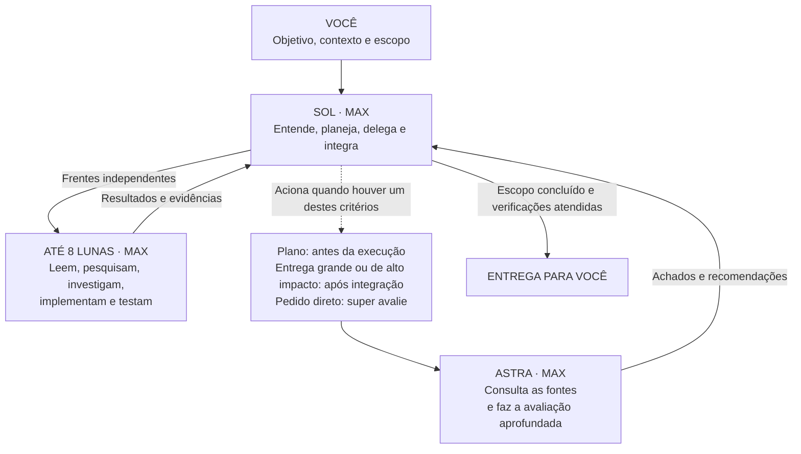

# Codex Project Orchestrator

**Sol `max` coordena, Luna `max` executa e Astra `max` avalia em momentos definidos.**

Sol mantém requisitos, planos e integração. Luna concentra leitura, investigação, implementação e verificações. Astra avalia planos de implementação, entregas grandes ou de alto impacto e pedidos diretos de avaliação aprofundada, como “super avalie”.

Os agentes, as configurações e as instruções ficam no projeto. O instalador preserva opções existentes, cria backups locais e permite restaurar o estado anterior.

[English](README.en.md) · [Instalação detalhada](docs/installation.md) · [Arquitetura](docs/architecture.md) · [Avaliação](docs/evaluation.md)

## Instalar ou atualizar com uma IA

Envie a URL deste repositório para a IA que já está trabalhando no projeto de destino. Um pedido suficiente é:

> Instale ou atualize o Codex Project Orchestrator no projeto atual seguindo o README: https://github.com/luisjuniorj/codex-project-orchestrator

Se você é a IA responsável pela operação, siga este protocolo:

1. Determine a raiz do projeto de destino. Use o projeto no qual o usuário está trabalhando; a cópia deste instalador nunca é o destino. Se houver mais de um candidato plausível, esclareça o caminho antes de gravar.
2. Obtenha uma cópia nova deste repositório em uma pasta temporária fora do destino. Leia o README da revisão obtida e não copie templates manualmente.
3. Crie o ambiente virtual nessa cópia e instale `requirements.txt`. Não altere a instalação global do Python ou do Codex.
4. Execute `install --dry-run` com o caminho absoluto do destino. O mesmo comando atende uma instalação nova e uma atualização registrada.
5. Se a prévia for válida, execute `install` sem `--dry-run` e depois `status`. Se houver divergência, colisão ou backup inválido, não force, não apague o estado e não sobrescreva arquivos; apresente os caminhos e a causa ao usuário.
6. Confira no Git do destino somente os arquivos relatados pelo instalador. Informe a versão instalada, os arquivos alterados e o resultado de `status`. Não faça commit ou push sem solicitação do usuário.
7. Oriente o usuário a abrir uma nova tarefa do Codex para carregar a configuração.

O fluxo é deliberadamente idempotente. Uma IA não precisa descobrir a versão instalada nem desinstalar antes de atualizar: deve usar uma cópia recente do instalador e repetir a sequência `install --dry-run`, `install`, `status`.

## Instalação pela linha de comando

Pré-requisitos: **Python 3.11+**, uma versão do Codex com agentes personalizados e acesso aos modelos utilizados. O projeto deve estar marcado como confiável no Codex. A disponibilidade depende do plano e do cliente; este projeto não concede acesso a modelos.

Clone este repositório pelo botão **Code** ou baixe e extraia o ZIP em uma pasta fora do projeto de destino. Na raiz da cópia do instalador, execute:

```sh
# macOS / Linux: ambiente Python local a esta cópia do instalador
python3 -m venv .venv
source .venv/bin/activate
python -m pip install -r requirements.txt

# Troque o caminho abaixo pela pasta do projeto que receberá os agentes
python install.py install --project "/caminho/do/meu-projeto" --dry-run
python install.py install --project "/caminho/do/meu-projeto"
python install.py status --project "/caminho/do/meu-projeto"
```

O primeiro `install` mostra a prévia sem gravar arquivos. O segundo aplica a configuração. A flag `--project` é obrigatória: informe o projeto que receberá o fluxo, e não a pasta deste instalador.

No Windows, os comandos equivalentes de preparação são:

```powershell
py -3 -m venv .venv
.\.venv\Scripts\python.exe -m pip install -r requirements.txt
.\.venv\Scripts\python.exe install.py install --project "C:\projetos\meu-projeto" --dry-run
.\.venv\Scripts\python.exe install.py install --project "C:\projetos\meu-projeto"
```

Depois, abra **uma nova tarefa no projeto**. Confira o modelo e esforço selecionados e mantenha Fast desligado se a prioridade for preservar uso. Na CLI do Codex, `/fast off` e `/fast status` controlam essa opção.

## O que será instalado

```text
meu-projeto/
├── AGENTS.md                           # bloco de regras acrescentado
└── .codex/
    ├── config.toml                     # opções mescladas, comentários preservados
    ├── .gitignore                      # exclui estado e backups do Git
    ├── agents/
    │   ├── cpo_explorer.toml
    │   ├── cpo_worker.toml
    │   ├── cpo_investigator.toml
    │   └── cpo_reviewer.toml
    └── .project-orchestrator/           # estado local para restauração
        ├── state.json
        └── original/                   # arquivos anteriores, quando existiam
```

Se houver um `AGENTS.override.md` não vazio na raiz do projeto, o bloco será acrescentado nele, preservando o `AGENTS.md`. As instruções existentes permanecem; revise possíveis conflitos com regras de orquestração já adotadas pelo projeto.

**Nenhuma configuração global é modificada.** A configuração local continua herdando opções não sobrescritas e respeitando permissões e políticas do ambiente. O instalador não muda autenticação, sandbox, MCPs ou a confiança concedida ao projeto.

## Modelos e esforços

| Papel | Modelo | Effort | Quando entra |
|---|---|---|---|
| Principal | `gpt-5.6-sol` | **`max`** | Entende, planeja, coordena e integra. |
| `cpo_explorer` | `gpt-5.6-luna` | **`max`** | Leitura e coleta de evidências delimitadas. |
| `cpo_worker` | `gpt-5.6-luna` | **`max`** | Implementação com entrega e arquivos definidos. |
| `cpo_investigator` | `gpt-5.6-luna` | **`max`** | Investigação delimitada entre componentes. |
| `cpo_reviewer` | `gpt-6-astra` | **`max`** | Avaliação profunda pelos critérios abaixo. |

Os três modelos usam `max`. É uma escolha explícita, sem promessa de economia ou qualidade superior em toda tarefa. O controle de consumo depende do escopo, da frequência das avaliações e do retrabalho. Modelos e esforços fixados nos TOMLs dos agentes prevalecem sobre os valores resolvidos ao criar o auxiliar; um pedido verbal não altera esses arquivos.



Até **oito auxiliares simultâneos**, além do Sol, podem permanecer abertos; o avaliador Astra conta dentro desses oito. Frentes independentes devem aproveitar o paralelismo, enquanto etapas dependentes continuam sequenciais e escritas no mesmo arquivo não são distribuídas ao mesmo tempo. Oito é capacidade, não meta. Cada contexto ainda consome uso, e os executores fazem sua própria verificação; não existe um tester obrigatório.

## Quando o Astra avalia

| Critério | Momento e objeto |
|---|---|
| Plano de implementação solicitado ou necessário | Sol prepara o plano; Astra avalia premissas, arquitetura, dependências, riscos e validação antes da execução. |
| Implementação grande ou de alto impacto | Astra avalia a entrega consolidada: correção, integração, regressões e lacunas relevantes nos testes. |
| Pedido direto de avaliação aprofundada | Astra avalia o objeto indicado, mesmo que pequeno. “Super avalie” é um exemplo; pedidos equivalentes também se aplicam. |

Sol decide pelo significado da tarefa, pela complexidade, pelo impacto e pelas dependências. Contagem de linhas ou arquivos não determina a necessidade de avaliação. Frases citadas e negações são interpretadas no contexto. Um checklist operacional de tarefa simples não exige criar um plano formal.

Sol confere atendimento aos requisitos e integração, sem fazer outra revisão profunda com o mesmo objetivo. Astra consulta código e contexto com independência. Avalie uma vez por plano ou entrega consolidada, evitando chamadas a cada atualização do executor. Correções voltam ao Luna; uma reavaliação necessária se concentra nos achados e nos efeitos das mudanças.

Um pedido que inclui plano e implementação significativa pode ter duas avaliações, de objetos distintos. Depois de incorporar os achados do plano, Sol prossegue com a implementação já autorizada. Se o pedido for somente planejamento ou avaliação, entrega esse resultado. Restrições explícitas do usuário e indisponibilidade de auxiliares prevalecem; uma avaliação impedida deve ser informada como não realizada.

## Configuração única

O instalador expõe somente este fluxo de orquestração. Não existe `--mode`, roteador por palavras nem troca automática do modelo principal. Instalações intactas de versões anteriores podem ser atualizadas; estados antigos `everyday` e `economy` são aceitos apenas para permitir atualização, consulta e restauração seguras.

## Atualizar

Use uma cópia recente deste repositório e execute a mesma rotina da instalação:

```sh
python install.py install --project "/caminho/do/meu-projeto" --dry-run
python install.py install --project "/caminho/do/meu-projeto"
python install.py status --project "/caminho/do/meu-projeto"
```

`install` detecta o estado registrado no destino e atualiza somente uma instalação íntegra. A atualização preserva os backups da primeira instalação, substitui os arquivos gerenciados pela versão atual e não duplica o bloco de instruções. Executar a rotina com a mesma versão não altera os arquivos.

Não use `uninstall` como etapa de atualização: ele restaura o estado anterior e remove o histórico local necessário para a manutenção automática. Se `--dry-run` indicar divergência, preserve o projeto e siga a [recuperação manual](docs/installation.md#arquivos-modificados-e-recuperação).

## Repetir em outros projetos

Use a mesma cópia do instalador, alterando `--project`:

```sh
python install.py install --project "/projetos/site"
python install.py install --project "/projetos/biblioteca"
```

Cada projeto terá seu próprio estado e suas próprias regras. Repetir a instalação sem mudanças não duplica instruções e não regrava arquivos gerenciados.

Você pode versionar a configuração, os agentes e as instruções geradas no Git do projeto. Quem clonar esses arquivos poderá usá-los no Codex sem executar o instalador novamente. **Os backups e o estado são locais e ficam ignorados pelo Git**; a restauração automática depende deles e não estará disponível em outra cópia que não possua esse histórico.

## Conferir e desinstalar

```sh
python install.py status --project "/caminho/do/meu-projeto"
python install.py uninstall --project "/caminho/do/meu-projeto" --dry-run
python install.py uninstall --project "/caminho/do/meu-projeto"
```

`status` informa a versão instalada, o principal e o teto de auxiliares registrados no arquivo de configuração, inclusive antes de atualizar uma instalação antiga. Verifica os arquivos em disco; não inspeciona uma sessão ativa do Codex. A desinstalação restaura os arquivos anteriores à primeira instalação e remove os arquivos criados por ela, desde que estejam intactos. Atualizações mantêm os backups originais.

Se um arquivo gerenciado tiver sido alterado depois, a reinstalação e a desinstalação param antes de sobrescrevê-lo. Isso inclui edições em configurações e instruções. Não há `--force`. Consulte [atualização e recuperação manual](docs/installation.md#arquivos-modificados-e-recuperação).

## Validação e limites

```sh
python -m unittest discover -s tests -v
```

A suíte cobre instalação, configuração única, atualização de estados legados, mesclagem de TOML, backups, conflitos, caminhos, reinstalação e rollback. O workflow de CI está configurado para Linux, macOS e Windows com Python 3.11 e 3.14. Os resultados de cada execução estão no [GitHub Actions](https://github.com/luisjuniorj/codex-project-orchestrator/actions). Veja também o [registro de validação local](docs/validation.md).

Os testes não chamam modelos e não consomem a franquia do Codex. Os [casos de avaliação semântica](docs/evaluation.md) permitem conferir a política em tarefas reais, mas não são apresentados como um benchmark já executado. Uma escolha de modelo ou topologia pode precisar de ajustes para seu trabalho.

## Origem e documentação

Projeto independente, sem vínculo ou endosso oficial da OpenAI. A arquitetura foi inspirada na discussão de modelos por função e no projeto [donvito/codex-astra-luna-orchestrator](https://github.com/donvito/codex-astra-luna-orchestrator/). O instalador e as instruções desta implementação foram escritos para este repositório.

As referências oficiais para formato e comportamento estão em [Subagents](https://learn.chatgpt.com/docs/agent-configuration/subagents), [Configuration](https://learn.chatgpt.com/docs/config-file/config-basic), [AGENTS.md](https://learn.chatgpt.com/docs/agent-configuration/agents-md) e [GPT-5.6 Luna](https://developers.openai.com/api/docs/models/gpt-5.6-luna). Consulte [as decisões de arquitetura](docs/architecture.md) para outras fontes e limitações.

Licença [MIT](LICENSE). Contribuições: [CONTRIBUTING.md](CONTRIBUTING.md).
