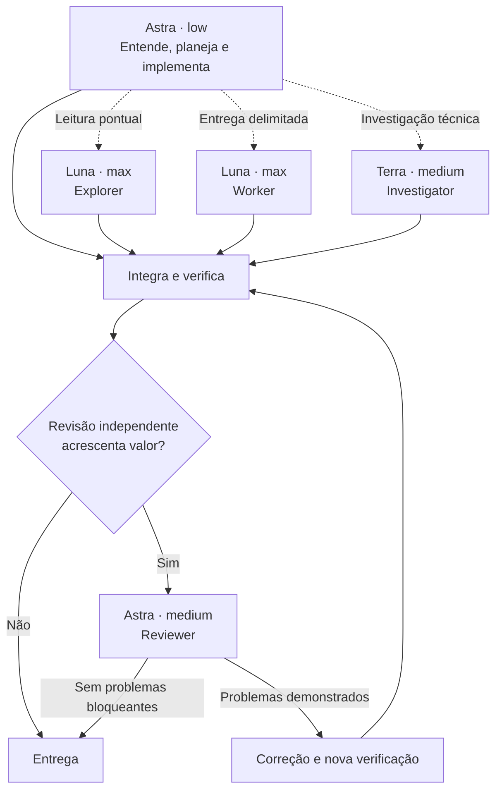

# Codex Project Orchestrator

**Orquestração seletiva para Codex, instalada em cada projeto. Luna sempre em `max`.**

Astra coordena trabalhos complexos e também implementa. Luna executa entregas delimitadas. Terra investiga questões que exigem mais julgamento. Uma revisão independente entra quando pode acrescentar algo relevante.

Os agentes, as configurações e as instruções ficam no projeto. O instalador preserva opções existentes, cria backups locais e permite restaurar o estado anterior.

[English](README.en.md) · [Instalação detalhada](docs/installation.md) · [Arquitetura](docs/architecture.md) · [Avaliação](docs/evaluation.md)

## Comece aqui

Pré-requisitos: **Python 3.11+**, uma versão do Codex com agentes personalizados e acesso aos modelos utilizados. O projeto deve estar marcado como confiável no Codex. A disponibilidade depende do plano e do cliente; este projeto não concede acesso a modelos.

Clone este repositório pelo botão **Code** ou baixe e extraia o ZIP. Na raiz do repositório, execute:

```sh
# macOS / Linux: ambiente Python local a esta cópia do instalador
python3 -m venv .venv
source .venv/bin/activate
python -m pip install -r requirements.txt

# Troque o caminho abaixo pela pasta do projeto que receberá os agentes
python install.py install --project "/caminho/do/meu-projeto" --dry-run
python install.py install --project "/caminho/do/meu-projeto"
python install.py status --project "/caminho/do/meu-projeto"
```

O primeiro `install` mostra a prévia sem gravar arquivos. O segundo aplica a configuração. A flag `--project` é obrigatória: informe o projeto que receberá o fluxo, e não a pasta deste instalador.

No Windows, os comandos equivalentes de preparação são:

```powershell
py -3 -m venv .venv
.\.venv\Scripts\python.exe -m pip install -r requirements.txt
.\.venv\Scripts\python.exe install.py install --project "C:\projetos\meu-projeto" --dry-run
.\.venv\Scripts\python.exe install.py install --project "C:\projetos\meu-projeto"
```

Depois, abra **uma nova tarefa no projeto**. Confira o modelo e esforço selecionados e mantenha Fast desligado se a prioridade for preservar uso. Na CLI do Codex, `/fast off` e `/fast status` controlam essa opção.

## O que será instalado

```text
meu-projeto/
├── AGENTS.md                           # bloco de regras acrescentado
└── .codex/
    ├── config.toml                     # opções mescladas, comentários preservados
    ├── .gitignore                      # exclui estado e backups do Git
    ├── agents/
    │   ├── cpo_explorer.toml
    │   ├── cpo_worker.toml
    │   ├── cpo_investigator.toml
    │   └── cpo_reviewer.toml
    └── .project-orchestrator/           # estado local para restauração
        ├── state.json
        └── original/                   # arquivos anteriores, quando existiam
```

Se houver um `AGENTS.override.md` não vazio na raiz do projeto, o bloco será acrescentado nele, preservando o `AGENTS.md`. As instruções existentes permanecem; revise possíveis conflitos com regras de orquestração já adotadas pelo projeto.

**Nenhuma configuração global é modificada.** A configuração local continua herdando opções não sobrescritas e respeitando permissões e políticas do ambiente. O instalador não muda autenticação, sandbox, MCPs ou a confiança concedida ao projeto.

## Modelos e esforços

| Papel | Modelo | Effort | Quando entra |
|---|---|---|---|
| Principal do modo complexo | `gpt-6-astra` | `low` | Entende, implementa, coordena e integra. |
| `cpo_explorer` | `gpt-5.6-luna` | **`max`** | Leitura e coleta de evidências delimitadas. |
| `cpo_worker` | `gpt-5.6-luna` | **`max`** | Implementação com entrega e arquivos definidos. |
| `cpo_investigator` | `gpt-5.6-terra` | `medium` | Investigação entre componentes. |
| `cpo_reviewer` | `gpt-6-astra` | `medium` | Revisão independente justificada. |

Luna usa `max` em todos os papéis e também no modo solo. Essa é uma escolha explícita desta configuração, sem promessa de economia ou qualidade superior em toda tarefa. Modelos e esforços fixados nos TOMLs dos agentes prevalecem sobre os valores resolvidos ao criar o auxiliar; um pedido verbal não deve ser tratado como alteração garantida do arquivo.



As linhas pontilhadas são opcionais. O uso normal é zero ou um auxiliar; o teto é **dois auxiliares simultâneos**, incluindo o revisor. Esse teto limita concorrência, não tokens ou consumo acumulado. Os executores fazem sua própria verificação; não existe um tester obrigatório.

## Três modos

| `--mode` | Principal | Auxiliares | Uso sugerido |
|---|---|---|---|
| `orchestration` — padrão | Astra `low` | Habilitados, teto 2 | Trabalho complexo e coordenação seletiva. |
| `everyday` | Terra `medium` | Desabilitados | Desenvolvimento cotidiano. |
| `economy` | Luna **`max`** | Desabilitados | Tarefas claras e delimitadas. |

Para instalar outro modo ou trocar o modo de uma instalação intacta:

```sh
python install.py install --project "/caminho/do/meu-projeto" --mode economy --dry-run
python install.py install --project "/caminho/do/meu-projeto" --mode economy
```

Os modos são escolhas explícitas. Não há um roteador que troca automaticamente o modelo principal conforme as palavras do pedido. Trocar somente o modelo no seletor do Codex também não muda automaticamente todas as opções do modo, como `agents.enabled`.

## Repetir em outros projetos

Use a mesma cópia do instalador, alterando `--project`:

```sh
python install.py install --project "/projetos/site" --mode orchestration
python install.py install --project "/projetos/biblioteca" --mode everyday
```

Cada projeto terá seu próprio estado e suas próprias regras. Repetir a instalação sem mudanças não duplica instruções e não regrava arquivos gerenciados.

Você pode versionar a configuração, os agentes e as instruções geradas no Git do projeto. Quem clonar esses arquivos poderá usá-los no Codex sem executar o instalador novamente. **Os backups e o estado são locais e ficam ignorados pelo Git**; a restauração automática depende deles e não estará disponível em outra cópia que não possua esse histórico.

Para pedir a instalação ao Codex, após disponibilizar este repositório:

> Leia o README do Codex Project Orchestrator nesta cópia. Instale o modo orchestration exclusivamente no projeto que estou indicando, preservando as configurações existentes e usando Luna sempre em max. Execute a prévia, confira os arquivos de destino e aplique a instalação. Não altere configurações globais.

## Conferir e desinstalar

```sh
python install.py status --project "/caminho/do/meu-projeto"
python install.py uninstall --project "/caminho/do/meu-projeto" --dry-run
python install.py uninstall --project "/caminho/do/meu-projeto"
```

`status` verifica os arquivos em disco; não inspeciona uma sessão ativa do Codex. A desinstalação restaura os arquivos anteriores à primeira instalação e remove os arquivos criados por ela, desde que estejam intactos. Trocar de modo mantém os backups originais.

Se um arquivo gerenciado tiver sido alterado depois, a reinstalação e a desinstalação param antes de sobrescrevê-lo. Isso inclui edições em configurações e instruções. Não há `--force`. Consulte [atualização e recuperação manual](docs/installation.md#arquivos-modificados-e-recuperação).

## Validação e limites

```sh
python -m unittest discover -s tests -v
```

A suíte cobre instalação, mesclagem de TOML, backups, modos, conflitos, caminhos, reinstalação e rollback. O workflow de CI está configurado para Linux, macOS e Windows com Python 3.11 e 3.14. Os resultados de cada execução estão no [GitHub Actions](https://github.com/luisjuniorj/codex-project-orchestrator/actions). Veja também o [registro de validação local](docs/validation.md).

Os testes não chamam modelos e não consomem a franquia do Codex. Os [casos de avaliação semântica](docs/evaluation.md) permitem conferir a política em tarefas reais, mas não são apresentados como um benchmark já executado. Uma escolha de modelo ou topologia pode precisar de ajustes para seu trabalho.

## Origem e documentação

Projeto independente, sem vínculo ou endosso oficial da OpenAI. A arquitetura foi inspirada na discussão de modelos por função e no projeto [donvito/codex-astra-luna-orchestrator](https://github.com/donvito/codex-astra-luna-orchestrator/). O instalador e as instruções desta implementação foram escritos para este repositório.

As referências oficiais para formato e comportamento estão em [Subagents](https://learn.chatgpt.com/docs/agent-configuration/subagents), [Configuration](https://learn.chatgpt.com/docs/config-file/config-basic), [AGENTS.md](https://learn.chatgpt.com/docs/agent-configuration/agents-md) e [GPT-5.6 Luna](https://developers.openai.com/api/docs/models/gpt-5.6-luna). Consulte [as decisões de arquitetura](docs/architecture.md) para outras fontes e limitações.

Licença [MIT](LICENSE). Contribuições: [CONTRIBUTING.md](CONTRIBUTING.md).
