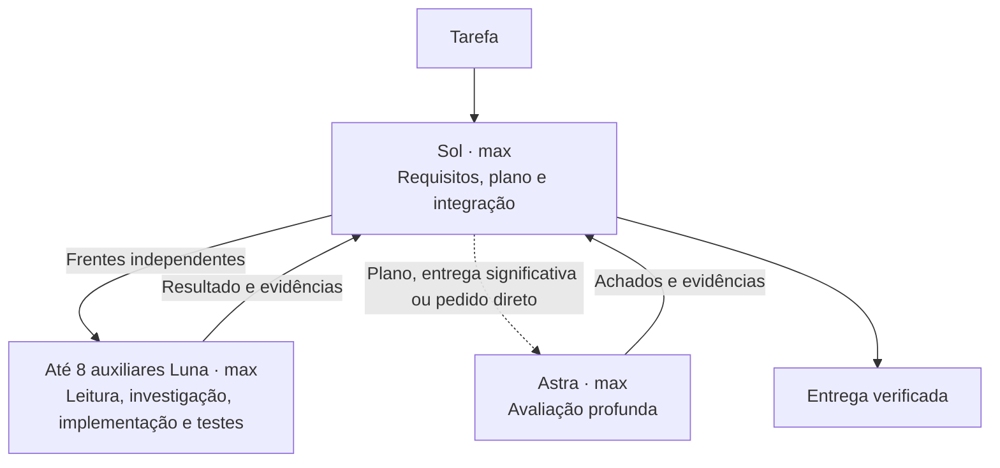

# Arquitetura e escolhas

Sol `max` mantém requisitos, planos e integração; Luna `max` concentra leitura, investigação, implementação e verificações; Astra `max` faz avaliações profundas em momentos definidos. Tarefas realmente pontuais podem ser concluídas pelo principal quando a delegação apenas acrescentaria trabalho.

## Fluxos de uso

O instalador aplica uma única configuração de orquestração. Ele não classifica linguagem natural, não lê os pedidos do usuário e não executa modelos. As decisões semânticas de delegação, escopo, hipótese e revisão ficam nas instruções do principal e dos auxiliares.

## Critérios de avaliação pelo Astra

Sol aciona `cpo_reviewer` quando houver um plano de implementação solicitado ou necessário, uma implementação consolidada grande ou de alto impacto, ou um pedido direto de avaliação aprofundada. Um plano é um artefato com decisões, dependências e estratégia de validação; tarefas simples não precisam produzir esse artefato por rotina. Complexidade, impacto e acoplamento orientam a avaliação de uma implementação, independentemente de contagens de arquivos ou linhas.

“Super avalie” exemplifica a intenção de avaliação aprofundada. Sol interpreta o pedido completo, incluindo outras formulações, negações e conteúdo citado. Não há comando especial nem classificador de palavras. Restrições do usuário e indisponibilidade de ferramentas prevalecem, e uma avaliação impedida deve ser informada como não realizada.

O plano consolidado é avaliado antes da execução dependente de suas decisões. Quando o pedido inclui implementar, os achados são incorporados e o trabalho autorizado continua. Um pedido somente de planejamento ou avaliação termina nessa entrega. Uma implementação significativa é avaliada ao ser consolidada; a avaliação do plano e a do código têm objetos distintos.

## Responsabilidade e repetição

Luna verifica sua própria entrega. Sol confere requisitos, resolve decisões e integra os resultados, sem repetir a avaliação profunda atribuída ao Astra. O avaliador recebe requisitos, decisões, arquivos ou diff pertinentes e resultados das verificações, mas consulta as fontes necessárias com independência.

A avaliação ocorre uma vez por plano ou entrega consolidada que satisfaça os critérios, evitando acionamentos a cada atualização do executor. Achados pertinentes voltam ao executor para correção. Sol confere as evidências de fechamento; se for necessária nova avaliação, o Astra examina os achados e os efeitos das mudanças. A ampliação de escopo exige novas evidências.

## Esforço e consumo

Sol, Luna e Astra usam `max` no fluxo de orquestração por escolha explícita. Luna tem taxas por token menores, mas o consumo total também depende de contexto, frequência de avaliações e retrabalho. Mais esforço pode elevar tempo e tokens; a configuração não comprova economia de franquia nem qualidade superior em toda tarefa.

Os modelos e esforços são fixados nos TOMLs dos agentes. O papel `cpo_investigator` investiga questões delimitadas entre componentes com Luna `max`; a decisão central permanece com Sol.

A versão 0.3.2 preserva os quatro caminhos de agentes e o schema de instalação das versões anteriores. Reinstalar uma instalação intacta remove os antigos modos alternativos, aplica a configuração única e converge o teto de auxiliares para oito, mantendo o backup original. Estados antigos `everyday` e `economy` continuam aceitos apenas para consulta, atualização e restauração seguras. O comando `status` lê a configuração instalada, de modo que uma instalação antiga continue sendo apresentada com seus próprios valores antes da atualização.

## Limites do desenho

- Oito auxiliares simultâneos, excluindo o principal, é um teto de concorrência e não uma meta. Cada contexto continua consumindo uso.
- Paralelismo ajuda quando as frentes são independentes; dependências, arquivos compartilhados e decisões ainda abertas exigem coordenação ou execução sequencial.
- A proibição de delegação em cascata é uma instrução de comportamento, não um mecanismo rígido de orçamento.
- Um revisor adicional não garante encontrar todos os defeitos. Achados devem ter evidências.
- Os testes do instalador comprovam propriedades de arquivos e configuração; não comprovam a qualidade dos modelos ou economia da franquia.
- Configuração por projeto não elimina regras globais, restrições administradas ou disponibilidade por conta.
- Max no Luna não estabelece equivalência com Astra em qualquer esforço.

## Evidência que orienta o projeto

OpenAI documenta agentes locais, configurações por agente e esforços de raciocínio. Também alerta para o consumo adicional de contextos separados. Anthropic descreve situações em que avaliação independente acrescentou qualidade e outras em que virou sobrecarga. Cursor relata a remoção de um papel de integração que criava gargalos. Google Research encontrou ganhos e perdas de sistemas multiagentes conforme as dependências da tarefa.

Essas fontes sustentam a especialização seletiva; não validam a combinação exata deste repositório nem oferecem uma previsão de economia para uma assinatura individual.

| Fonte | Uso nesta implementação |
|---|---|
| OpenAI, [Subagents](https://learn.chatgpt.com/docs/agent-configuration/subagents) | Formato de agentes e configurações por função. |
| OpenAI, [Models](https://learn.chatgpt.com/docs/models) e [Luna](https://developers.openai.com/api/docs/models/gpt-5.6-luna) | Identificadores e esforços suportados. |
| OpenAI, [Sol](https://developers.openai.com/api/docs/models/gpt-5.6-sol) e [Astra](https://developers.openai.com/api/docs/models/gpt-6-astra) | Modelos configurados para coordenação e avaliação. |
| OpenAI, [Reasoning](https://developers.openai.com/api/docs/guides/reasoning#reasoning-effort) | Critérios de esforço. |
| OpenAI, [Rethinking skills and prompts for GPT-6 Astra](https://developers.openai.com/blog/rethinking-skills-and-prompts-for-gpt-6-astra), setembro de 2026 | Escopo das instruções, contexto proporcional e critérios de conclusão. |
| OpenAI, [Pricing](https://learn.chatgpt.com/docs/pricing) e [Speed](https://learn.chatgpt.com/docs/agent-configuration/speed) | Consumo e Fast; nenhum multiplicador é usado como promessa de economia. |
| Anthropic, [Harness design](https://www.anthropic.com/engineering/harness-design-long-running-apps), março de 2026 | Revisão e simplificação conforme a necessidade. |
| Cursor, [Scaling long-running autonomous coding](https://cursor.com/blog/scaling-agents), janeiro de 2026 | Especialização e custo de coordenação. |
| Google Research, [Scaling agent systems](https://research.google/blog/towards-a-science-of-scaling-agent-systems-when-and-why-agent-systems-work/), janeiro de 2026 | Dependências e divisibilidade da tarefa. |

Referências consultadas em setembro de 2026. Reavalie campos, modelos e comportamentos ao atualizar o Codex.
