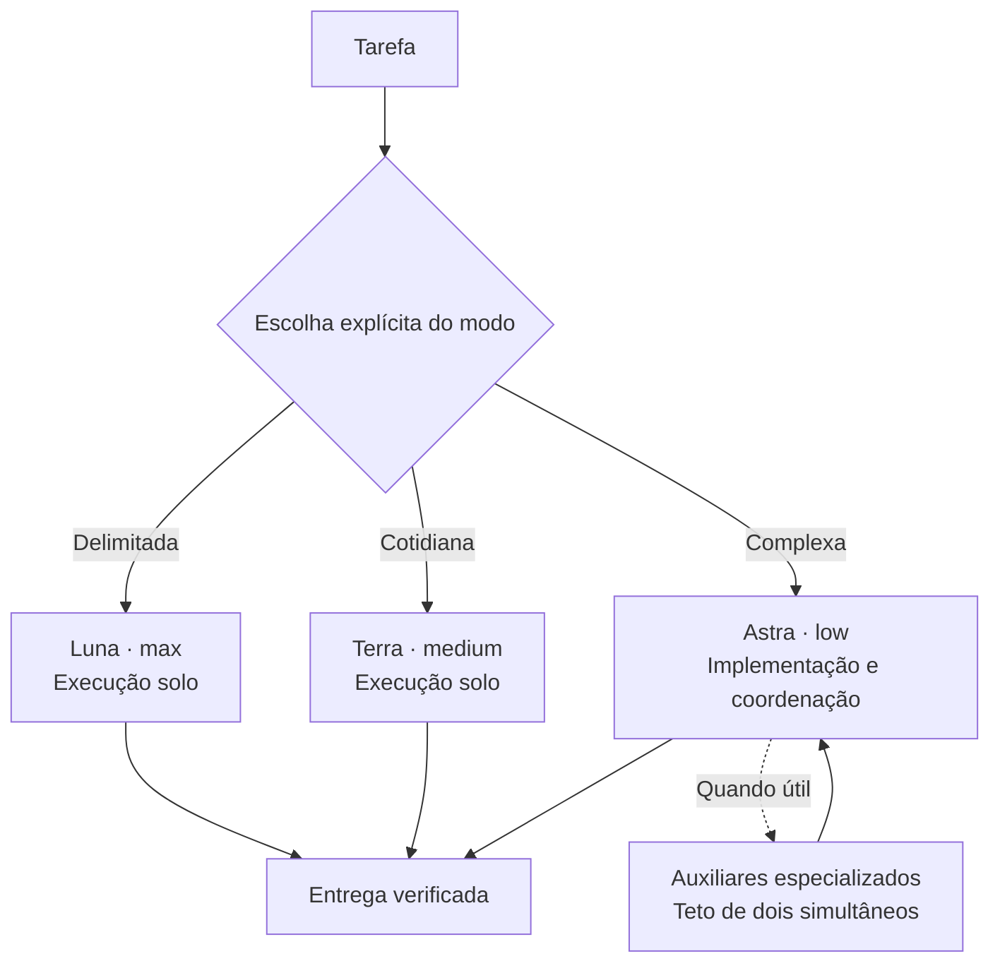

# Arquitetura e escolhas

Esta configuração oferece papéis especializados sem exigir uma equipe completa para cada tarefa. O principal continua implementando e validando. A decisão de delegar pertence ao agente, orientado pelos requisitos, dependências e critérios de conclusão.

## Fluxos de uso

O instalador seleciona um modo por argumento explícito. Ele não classifica linguagem natural, não lê os pedidos do usuário e não executa modelos. As decisões semânticas de delegação, escopo, hipótese e revisão ficam nas instruções do principal e dos auxiliares.

## Por que Luna sempre max

Luna tem taxas por token menores que os demais modelos desta configuração e suporta `max`. O projeto escolhe usar esse esforço em todas as funções Luna, concentrando o controle de consumo na necessidade e no escopo das chamadas. Isso é uma política de uso, não uma conclusão de benchmark. Mais esforço pode elevar o tempo e a quantidade de tokens.

Terra `medium` serve a investigações que exigem conectar comportamentos. Astra `low` é o ponto inicial do principal complexo; problemas mais difíceis podem justificar selecionar `medium` ou `high`. O revisor fornecido é fixado em Astra `medium`. Para usar `high`, adapte explicitamente seu TOML ou crie outro papel, considerando que editar arquivos gerenciados afeta a restauração automática.

Sol e Spark não são dependências desta primeira versão. Evitar uma cadeia obrigatória de modelos mantém o fluxo menor. Eles podem ser avaliados em projetos específicos, conforme acesso e necessidades.

## Limites do desenho

- Dois auxiliares simultâneos é um teto de concorrência. Várias chamadas sucessivas ainda podem consumir muito.
- A proibição de delegação em cascata é uma instrução de comportamento, não um mecanismo rígido de orçamento.
- Um revisor adicional não garante encontrar todos os defeitos. Achados devem ter evidências.
- Os testes do instalador comprovam propriedades de arquivos e configuração; não comprovam a qualidade dos modelos ou economia da franquia.
- Configuração por projeto não elimina regras globais, restrições administradas ou disponibilidade por conta.
- Max no Luna não estabelece equivalência com Astra em qualquer esforço.

## Evidência que orienta o projeto

OpenAI documenta agentes locais, configurações por agente e esforços de raciocínio. Também alerta para o consumo adicional de contextos separados. Anthropic descreve situações em que avaliação independente acrescentou qualidade e outras em que virou sobrecarga. Cursor relata a remoção de um papel de integração que criava gargalos. Google Research encontrou ganhos e perdas de sistemas multiagentes conforme as dependências da tarefa.

Essas fontes sustentam a especialização seletiva; não validam a combinação exata deste repositório nem oferecem uma previsão de economia para uma assinatura individual.

| Fonte | Uso nesta implementação |
|---|---|
| OpenAI, [Subagents](https://learn.chatgpt.com/docs/agent-configuration/subagents) | Formato de agentes e configurações por função. |
| OpenAI, [Models](https://learn.chatgpt.com/docs/models) e [Luna](https://developers.openai.com/api/docs/models/gpt-5.6-luna) | Identificadores e esforços suportados. |
| OpenAI, [Reasoning](https://developers.openai.com/api/docs/guides/reasoning#reasoning-effort) | Critérios de esforço. |
| OpenAI, [Pricing](https://learn.chatgpt.com/docs/pricing) e [Speed](https://learn.chatgpt.com/docs/agent-configuration/speed) | Consumo e Fast; nenhum multiplicador é usado como promessa de economia. |
| Anthropic, [Harness design](https://www.anthropic.com/engineering/harness-design-long-running-apps), março de 2026 | Revisão e simplificação conforme a necessidade. |
| Cursor, [Scaling long-running autonomous coding](https://cursor.com/blog/scaling-agents), janeiro de 2026 | Especialização e custo de coordenação. |
| Google Research, [Scaling agent systems](https://research.google/blog/towards-a-science-of-scaling-agent-systems-when-and-why-agent-systems-work/), janeiro de 2026 | Dependências e divisibilidade da tarefa. |

Referências consultadas em setembro de 2026. Reavalie campos, modelos e comportamentos ao atualizar o Codex.
